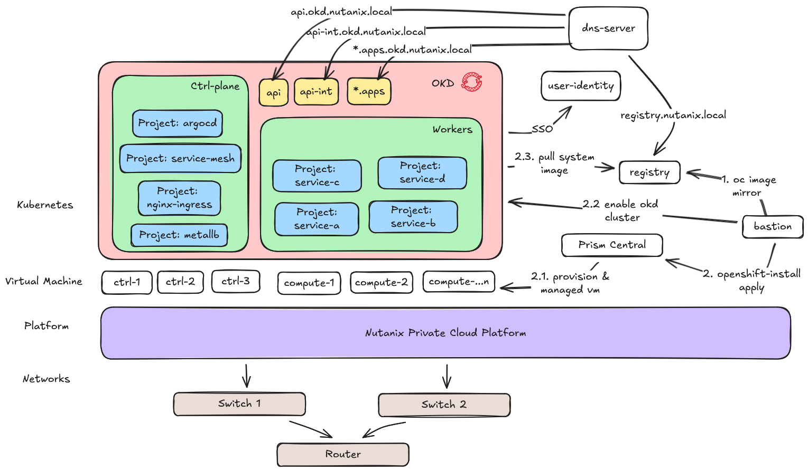

# Deploying OKD on Nutanix cluster

Design untuk meng-implementasikan OKD dengan production grade yang akan kita buat seperti berikut:

Komponent yang di butuhkan adalah

| Component | Version | Mandatory |
| :---      | :---      | :---      |
| Prism Element | `>= 6.10.x` | `yes` |
| Prism Central | `2023.6.x`   | `yes`  |
| Bastion       | `Fedora coreos 8` / `Redhat 8` | `yes` |
| Registry      | compatible private registry | `yes` if you want to use darkside mode else optional then use internet to download container image | 